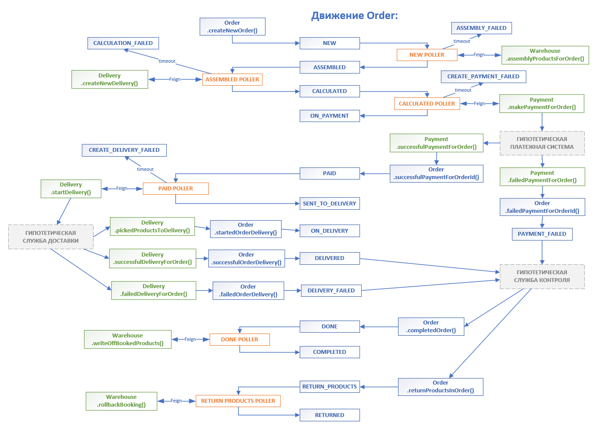

# Модуль COMMERCE

Во взаимодействии модулей order, payment, delivery между собой применен подход, обеспечивающий 
гарантированную доставку с помощью REST-запросов

За основу взят шаблон Transactional outbox
https://microservices.io/patterns/data/transactional-outbox.html 
и творчески доработан:

- вместо scheduling используется Polling publisher. Pollers запускаются в отдельных потоках и 
опрашивают в цикле базу данных, обрабатывая новые данные
- используется флаг модифицикации данных для уменьшения нагрузки на БД
- вместо таблицы Outbox используется маршрутизация сущностей на основе статусов
- Poller запрашивает сущность в определенном статусе, делает вызовы REST и меняет статус,
переводя сущность на следующий шаг обработки
- Пока REST не вернет нужный результат, статус не изменится и Poller будет повторять попытки
- По таймауту поллер завершит попытки и переведет сущность в failed-статус для ручной обработки

# Маршрутизация сущности Order

